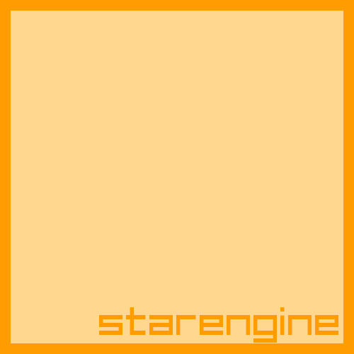

# starengine
A code-only WIP game engine with a raylib rendering backend and cocos2dx-ish feel

## Platform support (top to bottom most supported):
- Linux
- Windows (Planned)
- Nintendo Switch (Planned)
