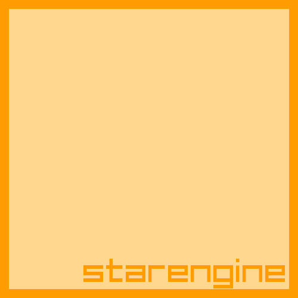

# starengine
A code-only WIP game engine with a raylib rendering backend and cocos2dx-ish feel



## Platform support (top to bottom most supported):
- Linux
- Windows (Planned)
- Nintendo Switch (Planned)

## Get started
First of all, this project is WIP and currently not intended for real use, but if you want to check it out, here are the instructions on how to do so:
- Clone the repo: ```git clone https://github.com/aceinetx/starengine```
- Change the project's name in the CMakeLists.txt to the game name
- Configure: ```mkdir build -p; cd build; cmake .. -DCMAKE_BUILD_TYPE=Debug```
- Build: ```make```
